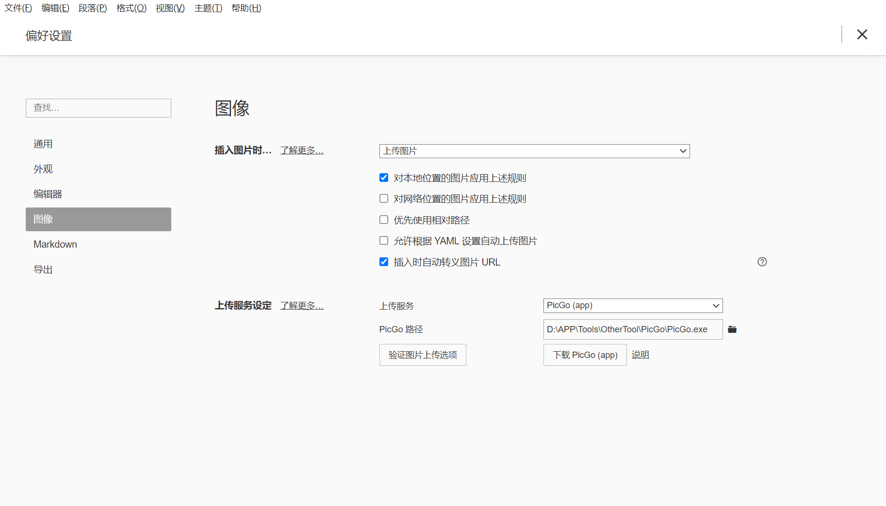
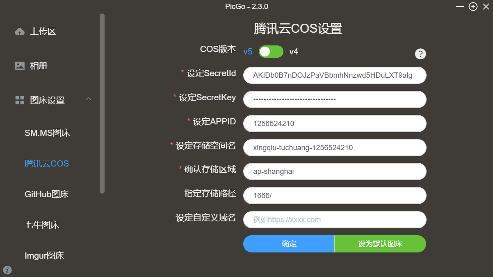

-
	- #计划-年2022-每天
		- [[掘金小册-小程序云开发]] 放弃
		- [[鱼皮-用户中心项目]]
		- 重装node.js   弄下 环境变量（想个能不能把所有cmd文件装在一起，这样一个环境变量就OK了）
		-
		-
		-
	- #完成-年2022-每天
	- ……AHK脚本 是管理员权限的话开机自启会有问题！……
	- Vivaldi浏览器 Ctrl+数字 切换标题页 挺方便的
	- typorn 图像上传服务
	  collapsed:: true
		- 
		- 无意间又想起了 鱼皮大佬 贡献的腾讯云COS服务
		  
		-
	-
	-
	- #杂记
	-
	-
	- #📌时间戳
		- 9:30 东区吃早饭
		  -油条一根上大学几年没吃了
		  -肉松蛋糕一个
		  -东区的树落花，黄色的，地上铺满了，有点像动漫场景，秒速五厘米的樱花飘落
		- 17:40 到图书馆，上节篮球课没轮到考试，下周考
		  现在弄好下 环境变量
		-
		-
	-
-